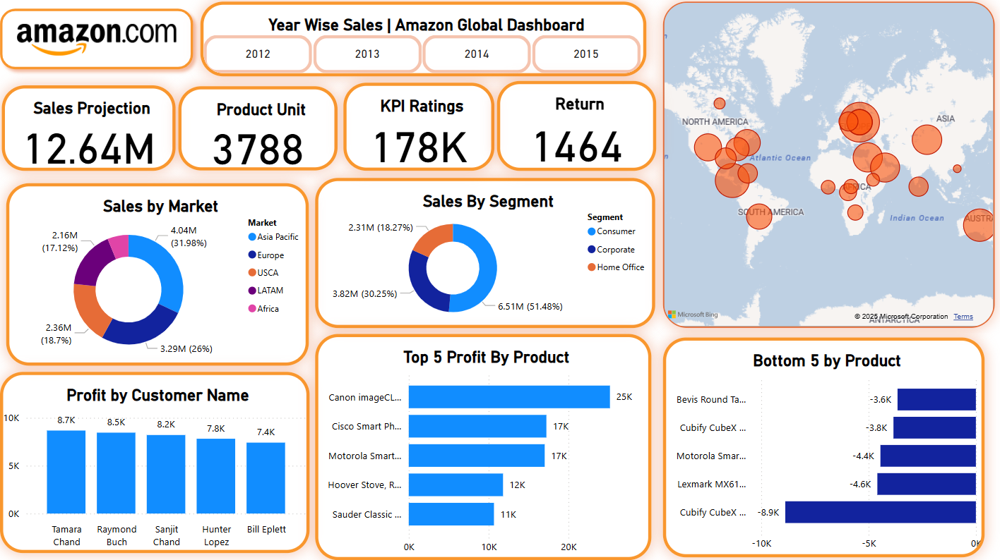

#  Amazon Global Sales Dashboard

This repository contains a **Power BI dashboard** created during a data analytics workshop. The dashboard visualizes **Amazon's global sales data** across various regions, segments, and products.

---

##  Key Features

- **Year-Wise Sales Toggle (2012–2015)**
- **Sales Projection**: 12.64M
- **Product Units Sold**: 3788
- **KPI Ratings**: 178K
- **Returns**: 1464

###  Breakdown Visualizations:
- **Sales by Market**: Asia Pacific, Europe, USCA, LATAM, Africa
- **Sales by Segment**: Consumer, Corporate, Home Office
- **Profit by Customer**: Top 5 individual contributors
- **Top 5 Products by Profit**
- **Bottom 5 Products by Profit**
- **Global Sales Map** with geographic distribution of sales

---

##  Files Included

- `dashboard_screenshot.png` – The dashboard image
- `global_superstore.csv` – **Sample dataset** used to build the dashboard
  
---

## 🙏 Acknowledgments

This dashboard project was created by following the tutorial by [Nishant Sir] on YouTube.

Original video: [https://youtu.be/2OgcZF72oEs?si=V8IVGKuG9qSZmJnb]

This repository is for educational and practice purposes only.
All credits go to the original creator for the concept and design.
The dashboard has been customized with modified colors and styling for personal learning purposes.
